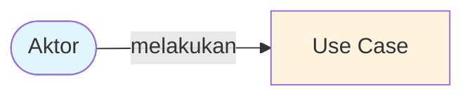
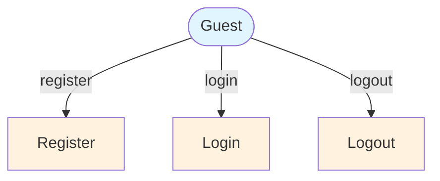
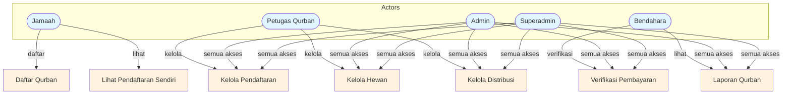
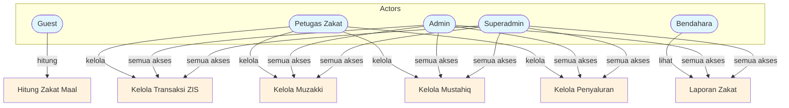
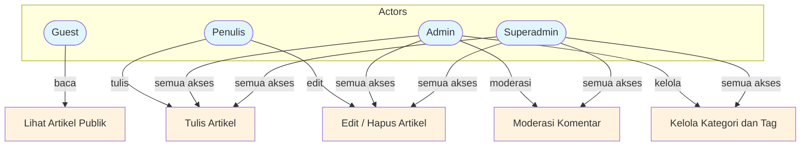
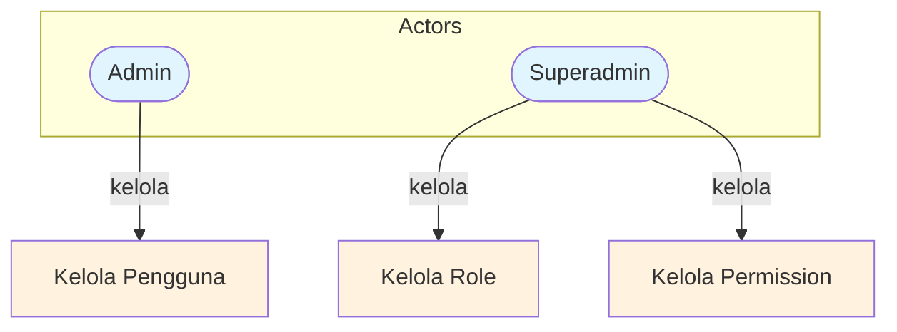
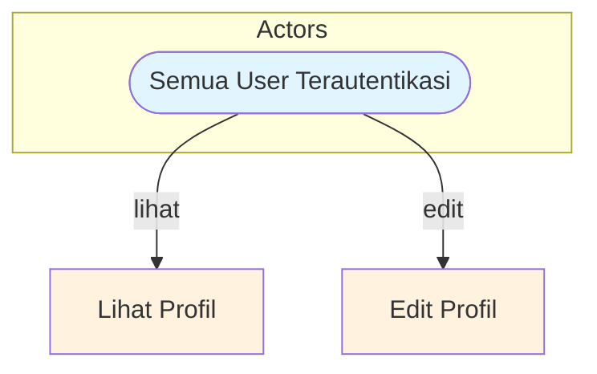
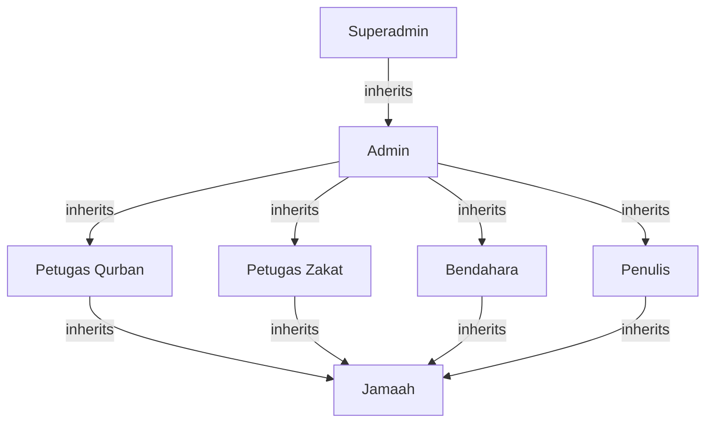
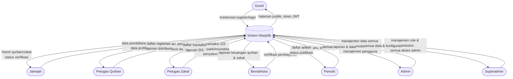

# Software Design Document — Masjidfy

## 1. Use Case Diagram

Setiap use case diagram disajikan per modul menggunakan `flowchart TD` agar kompatibel dengan semua renderer Mermaid.

### Legend

### Modul Autentikasi

### Modul Qurban

### Modul Zakat

### Modul Blog

### Modul Manajemen

### Modul Profil

---

## 2. Hierarki Role

**Penjelasan:**
- Setiap role mewarisi akses role di bawahnya.
- `superadmin` memiliki semua akses `admin` + manajemen role & permission.
- `admin` memiliki akses ke semua modul (qurban, zakat, blog) + manajemen pengguna.
- `petugas_qurban`, `petugas_zakat`, `bendahara`, dan `penulis` memiliki akses terbatas pada modul masing-masing.
- `jamaah` adalah role dasar untuk pengguna terdaftar.

---

## 3. DFD Level 0 — Diagram Konteks

---

## 4. DFD Level 1

```mermaid
flowchart TD
  %% === External Entities ===
  Guest([Guest])
  Jamaah([Jamaah])
  PetQurban([Petugas Qurban])
  PetZakat([Petugas Zakat])
  Bendahara([Bendahara])
  Penulis([Penulis])
  Admin([Admin])
  Superadmin([Superadmin])

  %% === Processes ===
  P1[Proses 1\nAutentikasi]
  P2[Proses 2\nQurban]
  P3[Proses 3\nZakat]
  P4[Proses 4\nBlog]
  P5[Proses 5\nManajemen]
  P6[Proses 6\nProfil]

  %% === Data Stores ===
  DS1[(D1 Data Pengguna)]
  DS2[(D2 Data Qurban)]
  DS3[(D3 Data Zakat)]
  DS4[(D4 Data Blog)]
  DS5[(D5 Data Pembayaran)]
  DS6[(D6 Data Role\n& Permission)]

  %% === Flows P1 — Autentikasi ===
  Guest -->|data register| P1
  Jamaah -->|data login| P1
  PetQurban -->|data login| P1
  PetZakat -->|data login| P1
  Bendahara -->|data login| P1
  Penulis -->|data login| P1
  Admin -->|data login| P1
  Superadmin -->|data login| P1
  P1 -->|token / error| Guest
  P1 -->|token / error| Jamaah
  P1 -->|token / error| PetQurban
  P1 -->|token / error| PetZakat
  P1 -->|token / error| Bendahara
  P1 -->|token / error| Penulis
  P1 -->|token / error| Admin
  P1 -->|token / error| Superadmin
  P1 <-->|read/write user| DS1
  P1 <-->|read role| DS6

  %% === Flows P2 — Qurban ===
  Jamaah -->|daftar qurban| P2
  PetQurban -->|kelola pendaftaran| P2
  PetQurban -->|kelola hewan| P2
  PetQurban -->|kelola distribusi| P2
  Bendahara -->|verifikasi bayar| P2
  P2 <-->|read/write| DS2
  P2 <-->|read/write| DS5
  P2 -->|histori| Jamaah
  P2 -->|laporan| Bendahara
  Admin -->|semua akses qurban| P2
  Superadmin -->|semua akses qurban| P2

  %% === Flows P3 — Zakat ===
  Guest -->|hitung zakat| P3
  PetZakat -->|kelola transaksi| P3
  PetZakat -->|kelola muzakki| P3
  PetZakat -->|kelola mustahiq| P3
  PetZakat -->|kelola penyaluran| P3
  Bendahara -->|lihat laporan| P3
  P3 <-->|read/write| DS3
  P3 -->|laporan| Bendahara
  Admin -->|semua akses zakat| P3
  Superadmin -->|semua akses zakat| P3

  %% === Flows P4 — Blog ===
  Guest -->|lihat artikel| P4
  Penulis -->|tulis/edit artikel| P4
  P4 <-->|read/write| DS4
  Admin -->|moderasi komentar| P4
  Admin -->|kelola kategori| P4
  Superadmin -->|moderasi komentar| P4
  Superadmin -->|kelola kategori| P4

  %% === Flows P5 — Manajemen ===
  Admin -->|kelola pengguna| P5
  Superadmin -->|kelola role| P5
  Superadmin -->|kelola permission| P5
  P5 <-->|read/write| DS1
  P5 <-->|read/write| DS6

  %% === Flows P6 — Profil ===
  Jamaah -->|lihat/edit profil| P6
  PetQurban -->|lihat/edit profil| P6
  PetZakat -->|lihat/edit profil| P6
  Bendahara -->|lihat/edit profil| P6
  Penulis -->|lihat/edit profil| P6
  Admin -->|lihat/edit profil| P6
  Superadmin -->|lihat/edit profil| P6
  P6 <-->|read/write| DS1

  %% === Style ===
  style P1 fill:#e1f5fe
  style P2 fill:#e8f5e9
  style P3 fill:#fff3e0
  style P4 fill:#f3e5f5
  style P5 fill:#ffebee
  style P6 fill:#e0f7fa
```

### Keterangan Proses DFD Level 1

| Proses | Deskripsi |
|--------|-----------|
| **P1 — Autentikasi** | Register, login, logout. Validasi kredensial, generate JWT, baca data role. |
| **P2 — Qurban** | CRUD pendaftaran, hewan, distribusi. Verifikasi pembayaran oleh bendahara. |
| **P3 — Zakat** | CRUD transaksi ZIS, muzakki, mustahiq, penyaluran. Kalkulator zakat publik. |
| **P4 — Blog** | CRUD artikel, komentar, kategori & tag. Publikasi oleh penulis/admin. |
| **P5 — Manajemen** | CRUD pengguna, role, permission. Hanya admin/superadmin. |
| **P6 — Profil** | Lihat dan edit data profil pengguna terautentikasi. |

### Keterangan Data Store

| Store | Data |
|-------|------|
| **D1 — Data Pengguna** | Nama, username, email, password hash, no. telepon, foto profil, status, timestamp. |
| **D2 — Data Qurban** | Hewan (jenis, berat, harga), registrasi peserta, distribusi daging (penerima, kupon). |
| **D3 — Data Zakat** | Transaksi ZIS (jenis, jumlah, tanggal), muzakki, mustahiq, penyaluran. |
| **D4 — Data Blog** | Artikel (judul, slug, konten, penulis), komentar (isi, author, parent_id), kategori, tag. |
| **D5 — Data Pembayaran** | Pembayaran qurban (peserta, hewan, jumlah, status, metode, tanggal). |
| **D6 — Data Role & Permission** | Role name, permission list, mapping user ↔ role. |

---

## 5. Kamus Data (Data Dictionary)

| Aliran Data | Dari | Ke | Isi |
|------------|------|----|-----|
| data register | Guest | P1 | `{ name, username, email, password, phone }` |
| data login | semua aktor | P1 | `{ username, password }` |
| token JWT | P1 | semua aktor | `{ access_token, user, roles }` |
| daftar qurban | Jamaah | P2 | `{ hewan_id, participant_name, alamat }` |
| kelola pendaftaran | PetQurban | P2 | `{ action, registration_id, status }` |
| kelola hewan | PetQurban | P2 | `{ jenis, berat, harga, supplier }` |
| kelola distribusi | PetQurban | P2 | `{ registration_id, recipient, coupon_count }` |
| verifikasi bayar | Bendahara | P2 | `{ payment_id, status }` |
| kelola transaksi | PetZakat | P3 | `{ jenis, jumlah, muzakki_id, tanggal }` |
| kelola muzakki | PetZakat | P3 | `{ name, phone, address }` |
| kelola mustahiq | PetZakat | P3 | `{ name, asnaf_category }` |
| kelola penyaluran | PetZakat | P3 | `{ mustahiq_id, amount, date }` |
| hitung zakat | Guest | P3 | `{ emas, perak, uangTunai, ... }` |
| tulis/edit artikel | Penulis | P4 | `{ title, slug, content, category, tags }` |
| moderasi komentar | Admin | P4 | `{ comment_id, action (approve/delete) }` |
| kelola pengguna | Admin | P5 | `{ user_id, name, role_ids, status }` |
| kelola role | Superadmin | P5 | `{ role_id, name, permissions[] }` |
| lihat/edit profil | semua aktor | P6 | `{ name, phone, photo }` |
